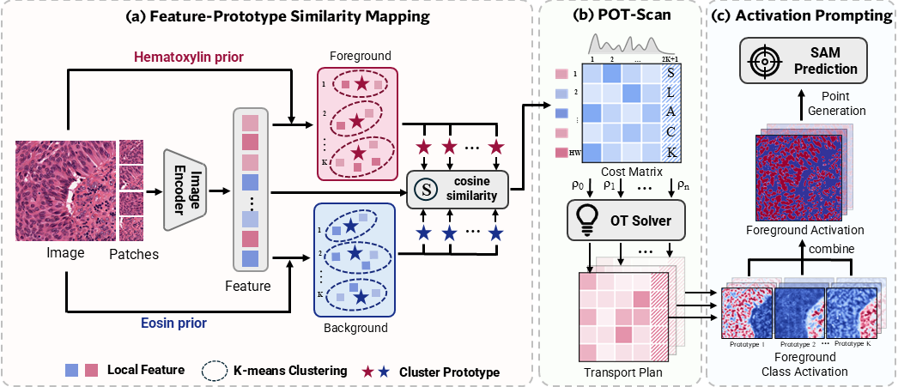
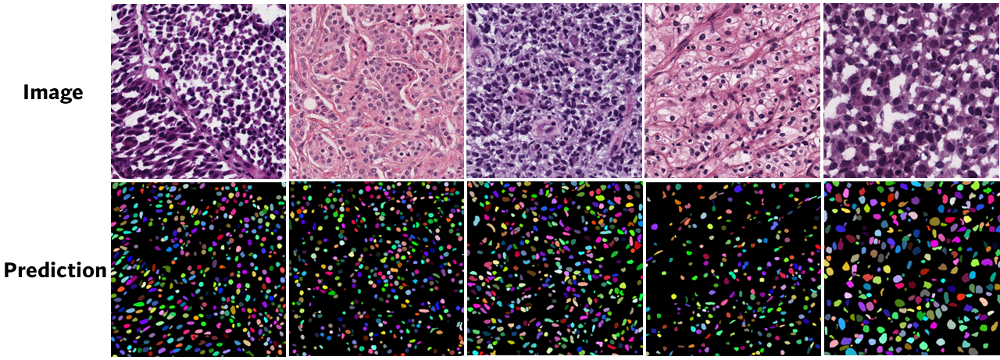
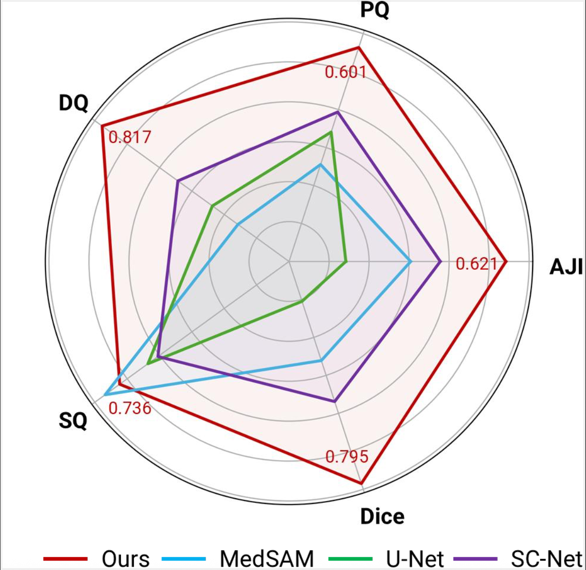
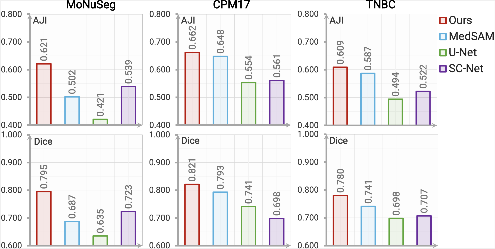

<p align="center">
  
  
  <h3 align="center"><strong>Supervise Less, See More: Training-free Nuclear Instance Segmentation with Prototype-Guided Prompting</strong></h3>

  <h3 align="center">ICML 2026</h3>

  <p align="center">
      <a href="https://kkwenz.github.io", target='_blank'>Wen Zhang</a><sup>1,2 ★</sup>&nbsp;&nbsp;&nbsp;
      <a href="https://soonera.github.io/qinren/" target='_blank'>Qin Ren</a><sup>1 ★</sup>&nbsp;&nbsp;&nbsp;
      <a href="https://github.com/liuwj003" target='_blank'>Wenjing Liu</a><sup>1</sup>&nbsp;&nbsp;&nbsp;
      <a href="https://haibinling.github.io/" target='_blank'>Haibin Ling</a><sup>1</sup>&nbsp;&nbsp;&nbsp;
      <a href="https://chenyuyou.me/" target='_blank'>Chenyu You</a><sup>1</sup>
  <br />
  <sup>1</sup>Stony Brook University&nbsp;&nbsp;&nbsp;
  <sup>2</sup>Johns Hopkins University&nbsp;&nbsp;&nbsp;
  <sup>★</sup> Equal Contribution&nbsp;&nbsp;&nbsp;
  </p>

</p>
  </a>
  <p align="center">
  <a href="https://arxiv.org/abs/2511.19953">
    
  </a>
  <a href="https://Y-Research-SBU.github.io/SPROUT">
    
  </a>
  <a href="https://huggingface.co/Y-Research-Group">
    
  </a>
    <a href="https://github.com/Y-Research-SBU/SPROUT" target='_blank'>
    
  </a>
</p>

---

`SPROUT` is a training-free framework that instantiates stain priors and prototype-guided optimal transport to prompt SAM, enabling robust and scalable nuclear segmentation.
- To the best of our knowledge, SPROUT is the first fully training-free framework for nuclear instance segmentation in H\&E pathology images without annotations. By addressing the limitations of reference-based methods, we introduce a novel self-reference mechanism that offers a lightweight yet generalizable solution to domain gaps.
- We propose POT-Scan, a principled scheme with theoretical guarantees that adaptively balances nuclear coverage and noise suppression. Our quantitative and qualitative analyses further elucidate the intrinsic behavior of prompt generation and verify its robust performance under diverse hyperparameter settings.
- We conduct extensive experiments on three challenging benchmarks, where SPROUT consistently achieves remarkable performance gains (+8.2% AJI on MoNuSeg). These highlight the potential of robust prompt generation and patch-based decomposition to unlock the zero-shot capabilities of vision foundation models in histopathology.


## :ferris_wheel: SPROUT Pipeline
|  |
| :-- | 
| SPROUT consists of three steps: (i) Feature–prototype similarity mapping: H\&E stain priors is to identify high-confidence foreground and background regions, from which clustering extracts representative prototypes that serve as anchors for similarity matching; (ii) POT-Scan: a partial optimal transport scheme that progressively aligns features to prototypes, filtering ambiguous assignments through partial mass transport; (iii) Activation prompting: prototype-reweighted activations are aggregated into foreground maps, from which positive and negative point prompts are sampled to guide SAM-based instance prediction. For clarity, high-dimensional features are illustrated as squares and stars. |


## :rocket: News
- 2026.05 Our paper is accepted by ICML 2026!
- 2025.11 Code released! Let's embrace training-free nuclear instance segmentation!

## Outline

- [SPROUT Pipeline](#ferris_wheel-sprout-pipeline)
- [Updates](#updates)
- [Outline](#outline)
- [Installation](#gear-installation)
- [Getting Started](#rocket-getting-started)
- [Self-Reference Strategy](#bar_chart-self-reference-strategy)
- [Performance](#bar_chart-performance)
- [Citation](#books-citation)
- [License](#license)
- [Acknowledgements](#acknowledgements)

## :gear: Installation

### Step 1: Setup

Clone the repository and create conda environment.
```bash
git clone https://github.com/Y-Research-SBU/SPROUT.git
cd SPROUT

conda create -n sprout python=3.10 -y
conda activate sprout
```

### Step 2: Build Environment

**General Requirments**
- Linux with Python ≥ 3.10, PyTorch ≥ 2.5.1, and torchvision matching the PyTorch version. Install them together at https://pytorch.org.
- [CUDA Toolkits](https://developer.nvidia.com/cuda-toolkit-archive) that match the CUDA version for your PyTorch installation (CUDA 12.1 recommended).
- For Windows users, [Windows Subsystem for Linux (WSL)](https://learn.microsoft.com/en-us/windows/wsl/install) with Ubuntu is strongly recommended.

We use PyTorch 2.5.1 with CUDA 12.1. Install PyTorch, torchvision, and torchaudio with the following command:

```bash
pip install torch==2.5.1 torchvision==0.20.1 torchaudio==2.5.1 --index-url https://download.pytorch.org/whl/cu121
```

**SAM2 Installation**

Our code integrates with [SAM2](https://github.com/facebookresearch/sam2/blob/main/INSTALL.md). Please make sure PyTorch is installed first.

Replace the `sam2` directory with the official repository:
```bash
git clone https://github.com/facebookresearch/sam2.git
cd sam2
```
Then install with CUDA extension build:
```bash
SAM2_BUILD_ALLOW_ERRORS=0 pip install -v -e ".[notebooks]"
```
All the SAM2 model checkpoints can be downloaded by running:
```bash
cd checkpoints && \
./download_ckpts.sh && \
cd ..
```

**Install Other Requirements**
```bash
pip install -r docs/requirements.txt
```

### Step 3: Dataset Preparation
Download the MoNuSeg, CPM17, and TNBC datasets to `data` directory. 
Rename the original dataset folders so that:
- `images`: raw images
- `annotations`: corresponding annotations

Use the pre-procesing scripts to prepare the dataset.
```bash
cd data
python monuseg.py --input_dir MoNuSeg
python cpm17.py --input_dir cpm17
python tnbc.py --input_dir TNBC --fname tnbc
```
Alternatively, you can directly download the preprocessed datasets here: [Dataset Donloads]().

After preprocessing, your data directory should look like this:
```
data
├── MoNuSeg
│   ├── train
│   │   ├── annotations
|   |   |   ├── TCGA-18-5592-01Z-00-DX1.xml
|   |   |   ├── TCGA-21-5784-01Z-00-DX1.xml
│   │   ├── images
|   |   |   ├── TCGA-18-5592-01Z-00-DX1.tif
|   |   |   ├── TCGA-21-5784-01Z-00-DX1.tif
|   |   ├── instances
|   |   ├── semantics
|   |   ├── png
|   |   |   ├── TCGA-18-5592-01Z-00-DX1.png
|   |   |   ├── TCGA-21-5784-01Z-00-DX1.png
|   |   ├── train.txt
│   ├── test
│   │   ├── annotations
│   │   ├── images
|   |   ├── instances
|   |   ├── semantics
|   |   ├── png
|   |   ├── test.txt
├── cpm17
├── TNBC
```


## :rocket: Getting Started
**Generate point prompts**
Please ensure you have access to the required backbone models from Hugging Face before running this step.
```bash
 python project/feature_points.py --input_dir data/MoNuSeg/train/png --output_dir results/MoNuSeg/train --index_file data/MoNuSeg/train.txt --model_name "hf-hub:bioptimus/UNI2-h" --save_points
```
**Generate instance masks**
```bash
 python project/runSAM.py --input_dir data/MoNuSeg/train/png --output_dir results/MoNuSeg/train --index_file data/MoNuSeg/train.txt
```
**Visualize Predictions**
```bash
 python project/visual_json.py --input_dir results/MoNuSeg/train --num_workers 6 --index_file  data/MoNuSeg/train.txt
 ```
**Evaluate Results**
```bash
 python project/eval.py --gt_dir data/MoNuSeg/train/instances --mask_dir /results/MoNuSeg/train
```
Prediced nuclear instance masks will look like:
  


## :chart_with_upwards_trend: Performance

<p align="left">
  
  
</p>


## Contact

For questions, feedback, or collaboration opportunities, please contact:

**Email**: [wzhan156@jh.edu](mailto:wzhan156@jh.edu), [chenyu.you@stonybrook.edu](mailto:chenyu.you@stonybrook.edu)


## License

MIT License


## Citation
If you find this work helpful for your research, please kindly consider citing our papers:

```bibtex
@inproceedings{zhang2025superviselessmoretrainingfree,
  title={Supervise Less, See More: Training-free Nuclear Instance Segmentation with Prototype-Guided Prompting},
  author={Wen Zhang and Qin Ren and Wenjing Liu and Haibin Ling and Chenyu You},
  booktitle={International Conference on Machine Learning},
  year={2026}
}
```


## Acknowledgements

We acknowledge the use of the following public resources, during the course of this work: <sup>1</sup>[SAM2](https://github.com/facebookresearch/sam2), <sup>2</sup>[PPOT](https://github.com/rhfeiyang/PPOT), <sup>3</sup>[DenseCRF](https://github.com/lucasb-eyer/pydensecrf/).

We thank the exceptional contributions from the above open-source repositories! :heart:
